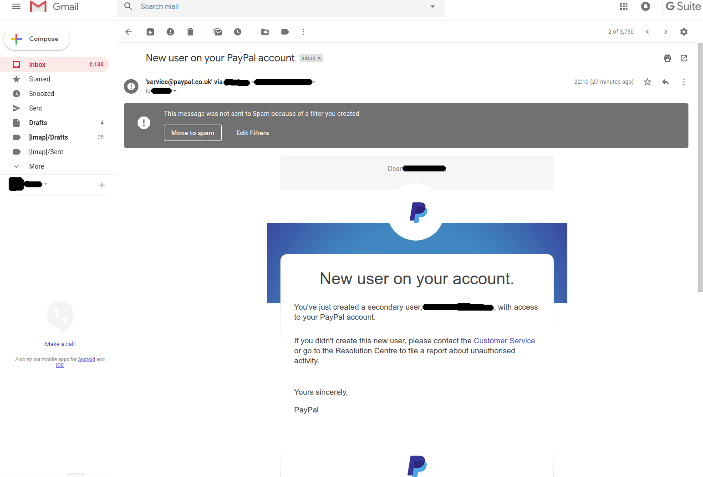

## If Paypal can't get past Gmail's Spam filter, then who can?

Using Google GSuite for business and PayPal for business.

I got this:

---

---

### Explanation

I don't trust Gmail's Spam filter, it has created many false positives for me in the past (including putting people's invoices into Spam so they didn't get paid).

That's why I've disabled it by creating a filter that prevents anything going to Spam.

In the above we can see that, had I not done that, an important security message from Paypal (connected straight to my bank account) would have gone to Spam.

**If Paypal's security team can't reliably send email to Gmail users, then who can?**
