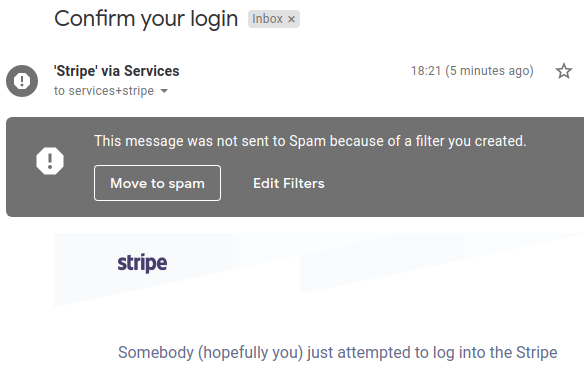

## If Paypal can't get past Gmail's Spam filter, then who can?

Using Google GSuite for business and PayPal for business.

After adding a new user to the account, I got this (the email was expected, but the fact that it's marked as Spam is not):

---

---

### Explanation

I don't trust Gmail's Spam filter, it has created many false positives for me in the past (including putting people's invoices into Spam so they didn't get paid).

That's why I've disabled it by creating a filter that prevents anything going to Spam.

In the above we can see that, had I not done that, an important security message from Paypal (connected straight to my bank account) would have gone to Spam.

**If Paypal's security team can't reliably send email to Gmail users, then who can?**

## Update: Google's response

A few hours after I posted this on [Hacker News](https://news.ycombinator.com/item?id=19099887), I got contacted by a member of Google's G Suite Security team, leading to the eventual explanation:

> Our analysts are taking a look, it seems there was nothing wrong on Paypal's end or your domain configuration. They have already deployed a short-term fix for this issue, you should not have this issue specifically with paypal again. We're still looking into whether we can use this to improve the quality of our filters in general.

### Response timeline

* 2019-02-07
  * I create this repo and [Hacker News](https://news.ycombinator.com/item?id=19099887) post
  * a few hours later, I get an email from a member of the G Suite Security team, asking whether I approve investigating this and whether I can provide details (I do)
* 2019-02-08
  * I am told that it's an issue on Google's side, and that they have rolled out a short-term fix specific to Paypal

While the issue is annoying and I don't know what the state of a full solution to this type of problem on their side is, the response time, time-to-workaround, and general communication in this were impressive.

## Update: Gmail spamfilters Stripe as well

On 2019-03-31, the same happened to an equally legitimate security notification from Stripe, when I tried to log into my Stripe account.

Gmail tells me that the only reason the email didn't go to Spam is because I disabled its Spam filter.

You can see the sanitised email headers in [`stripe-headers.txt`](stripe-headers.txt) if you want to analyse them.
